# HireME

HireME is a candidate-first hiring platform. Candidates maintain one rich, privacy-controlled profile and are invited to relevant opportunities; recruiters configure a pipeline while matching, assessments, reminders and shortlisting handle repetitive work.

This full-stack MVP implements the supplied product vision, proposal and expanded autonomous interview workflow as:

- a public candidate-focused landing experience and installable progressive web app;
- database-backed authentication with salted scrypt password hashes, opaque hashed sessions, HttpOnly cookies, lockout controls and role enforcement;
- live candidate and recruiter dashboards backed by PostgreSQL rather than embedded sample arrays;
- detailed candidate career records covering goals, skills, employment, education, projects, publications and certifications;
- optional private PDF/DOCX résumé uploads with authenticated downloads, file-size/type checks, checksums and versioned metadata;
- a PostgreSQL/Prisma domain model for profiles, verified evidence, organizations, jobs, ordered interview stages, invitations, submissions, model decisions, human overrides, consent, training examples and audit trails;
- an orchestration engine that creates a ranked pool, queues invitations, advances candidates through pre-screen, behavioural, technical and structured-agent interview stages, then produces a final face-to-face shortlist;
- a hybrid, explainable matching engine with lawful filters, semantic skill-graph retrieval, LambdaMART ranking, confidence flags and factor-level evidence;
- unit, API and browser test cases; and
- GitHub Actions CI plus a controlled Vercel production deployment workflow.

## Architecture

- **Web:** Next.js 15, React 19, TypeScript, semantic HTML and responsive CSS
- **API:** Next.js route handlers; FastAPI/Python matching service
- **Database:** PostgreSQL with Prisma. Relational constraints and transactions suit connected, high-integrity hiring records; JSON is used only for explainability metadata and audit context.
- **Hosting:** Vercel for the Next.js application; managed PostgreSQL (Vercel Postgres/Neon/Supabase); the Python service can run on Railway, Render, Fly.io or a container platform.

## Local setup

Requires Node 22+, pnpm 10+, Python 3.12+ and Docker.

```bash
cp .env.example .env
docker compose up -d postgres
pnpm install
pnpm prisma generate
pnpm prisma migrate dev --name init
pnpm dev
```

Visit `http://localhost:3000`, `/dashboard`, `/recruiter`, and `/onboarding`.

Demo sign-in:

- Recruiter: `recruiter@hireme.test`
- Candidate: `candidate@hireme.test`
- Password: `HireME-demo-2026!`

The local database is seeded with 12 candidates, a five-stage Greenly recruitment workflow, submissions and model-assisted decisions. Run `pnpm db:seed` to reset it.

On the first `npm run dev` or `npm start`, an idempotent data migration creates 10,000 Faker-generated candidate accounts for load and matching tests. It records version `faker-au-v1` in `DataMigration` and skips subsequent starts. Synthetic accounts use addresses such as `candidate.00001@synthetic.hireme.test` and password `HireME-Mock-2026!`. They are permanently marked `isSynthetic`; their external email delivery is suppressed. Run `npm run db:bootstrap-synthetic` manually to verify or apply the migration.

Run the Python service separately:

```bash
cd matching-service
python -m venv .venv
source .venv/bin/activate
pip install -r requirements.txt
uvicorn app.main:app --reload
```

Generate a reproducible, entirely synthetic ranking dataset with Faker and train the LambdaMART model:

```bash
npm run matching:generate
npm run matching:train
npm run matching:test
```

The default dataset contains 5,000 candidate-job examples across 50 query groups using seed `20260717`. Names and contact details are synthetic, protected attributes are not generated, and operational candidate data is not used. The resulting model and evaluation metrics are written to `matching-service/artifacts/`. Synthetic evaluation validates the software pipeline only; it is not evidence that the model is valid or fair for real employment decisions.

## Tests

```bash
pnpm typecheck
pnpm test
pnpm test:e2e
cd matching-service && pytest
```

The broader manual/integration matrix is in [TEST_CASES.md](./TEST_CASES.md).

## Contributor delivery workflow

All changes reach production through a pull request and the gated GitHub Actions workflow in [`.github/workflows/ci.yml`](./.github/workflows/ci.yml). Vercel's automatic Git deployments are disabled so that a commit cannot bypass the test gates.

```mermaid
flowchart LR
    A["Create feature branch"] --> B["Develop and test locally"]
    B --> C["Push branch and open pull request"]
    C --> D["Web and Python CI"]
    D --> E["Isolated PostgreSQL migrations and integration tests"]
    E --> F["Vercel preview deployment"]
    F --> G["Cloud smoke tests"]
    G --> H["Review and merge to main"]
    H --> I["Repeat verified build and cloud tests"]
    I --> J["Apply production migrations"]
    J --> K["Deploy to Vercel production"]
```



### From code change to production

1. Update local `main`, then create a focused branch. Codex-created branches use the `codex/<change-name>` convention; contributors may use the team's agreed `feature/`, `fix/`, or `chore/` convention.
2. Make small, reviewable changes and add or update tests alongside the implementation. Never commit `.env` files, credentials, generated test reports or production data.
3. Before pushing, run the relevant local quality checks:

   ```bash
   pnpm format:check
   pnpm lint
   pnpm typecheck
   pnpm test
   pnpm test:e2e:integration
   cd matching-service && ruff format --check . && ruff check . && pytest
   ```

4. Commit with a descriptive message, push the branch and open a pull request into `main`. Explain the behaviour change, tests performed, database impact and any deployment considerations.
5. GitHub Actions provisions an isolated PostgreSQL service and runs two independent quality gates:
   - **Web quality:** Prisma generation/validation/migrations, formatting, linting, TypeScript checks, unit tests, production build and Playwright authentication integration tests.
   - **Matching quality:** Python formatting, linting and pytest coverage for the FastAPI matching service.
6. After both quality jobs pass, GitHub builds and deploys an isolated Vercel preview. Playwright then tests the deployed health endpoint, public pages, PWA manifest and protected cron endpoint over HTTP.
7. Review the preview and obtain approval. Do not merge with failing or cancelled checks. A push to the pull-request branch automatically reruns the workflow with the new commit.
8. Merging to `main` repeats the verified workflow. Only after all cloud tests pass does the production job apply Prisma migrations to Neon and deploy the same prebuilt artifact to Vercel production.
9. Confirm the production deployment and health endpoint. If an application regression occurs, redeploy the previous known-good Vercel deployment. Database migrations must be backward-compatible; correct data/schema issues with a forward migration rather than rewriting an applied migration.

### CI/CD configuration

The protected GitHub `production` environment requires these secrets:

- `DATABASE_URL`
- `VERCEL_TOKEN`
- `VERCEL_ORG_ID`
- `VERCEL_PROJECT_ID`
- `VERCEL_AUTOMATION_BYPASS_SECRET`

Application runtime variables—including `DATABASE_URL`, `MATCHING_SERVICE_URL`, `RESEND_API_KEY`, `CRON_SECRET`, `EMAIL_FROM`, `EMAIL_TRANSPORT` and `NEXT_PUBLIC_APP_URL`—are managed separately in Vercel. Secrets must be rotated immediately if exposed and must never be printed in build logs or copied into source control.

The complete production checklist, environment scopes, migration policy and rollback procedure are documented in [docs/DEPLOYMENT.md](./docs/DEPLOYMENT.md).

## Production safeguards still required

Before handling real candidates, connect an email provider and object storage, add MFA/passkeys, field-level authorization, encrypted file storage, deletion/export workflows, distributed rate limits, malware scanning, observability and an independent bias/model-risk review. The implemented AI adapter records model and policy versions, rationale, confidence and reviewer overrides. Low-confidence outcomes require human review. Training examples must remain opt-in, de-identified and purpose-limited; operational candidate records must never silently become training data. AI proctoring should flag anomalies for human review and must not autonomously reject a person.
